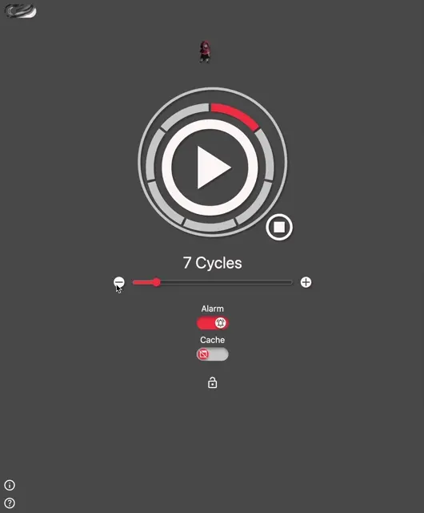
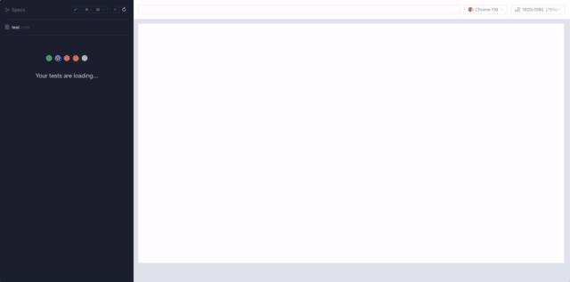
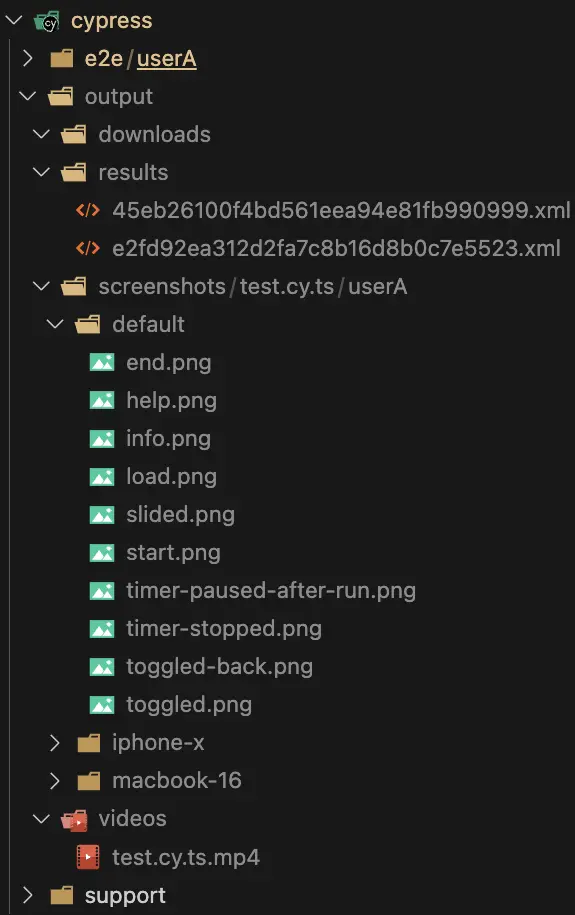
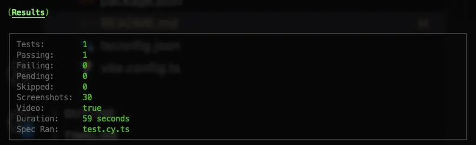
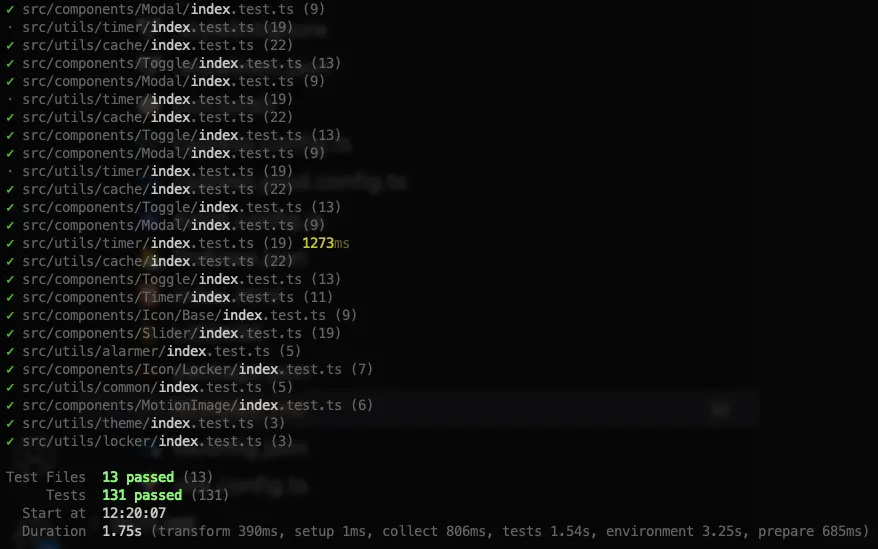

# pomodoro
A web application featuring pomodoro technique for self focus and self improvement on productivity



Disclaimer: The above animated cover does not represent the actual product. The time and tick speed have been significantly altered for illustration purposes.

## pre-requisite
1. [node](https://nodejs.org/en) (recommended v20 and above)
2. [bun](https://bun.sh/)
3. [browser](https://www.google.com/intl/en_sg/chrome/) (recommended chrome)

## external tools
[chart.js](https://www.chartjs.org/)

## how to use
1. install dependencies
```
bun install
```
2. run source code
```
bun run dev
```
3. run build code
```
bun run build
```
4. view build code locally
```
bun run preview
```
5. (optional) run linter
```
bun run test:linter
```
6. (optional) run unit test
```
bun run test:unit
```
7. (optional) run unit test while watching
```
bun run test:unit:watch
```
8. (optional) run e2e test (required build files)
```
bun run test:e2e:local
```
9. (optional) run e2e test headless with video records
```
bun run test:e2e
```
> do checkout package.json for more runtime scripts details!

## uiux design
[pomodoro-uiux-v1](https://www.figma.com/design/hkgaP8mY3reezpCiA6dzXJ/pomodoro-uiux-v1?node-id=15-29&t=uc0LoZ2A3aXj8sJc-1)

## e2e test (basic)

### video records


### output snapshot




## unit test


## backlogs
1. continue integrate ESLint v9 with other linter libraries
2. cleaner coupling and layers view between control (view - i render only | control - i control the views)
3. re-look at how to better design reuse-able component in vanilla js approach
4. resolve all TODO comments
5. adjust help modal's content alignment in mobile view

## credits
- [legnops's red hood character animation assets](https://legnops.itch.io/red-hood-character)

## contributors
dendrovis team